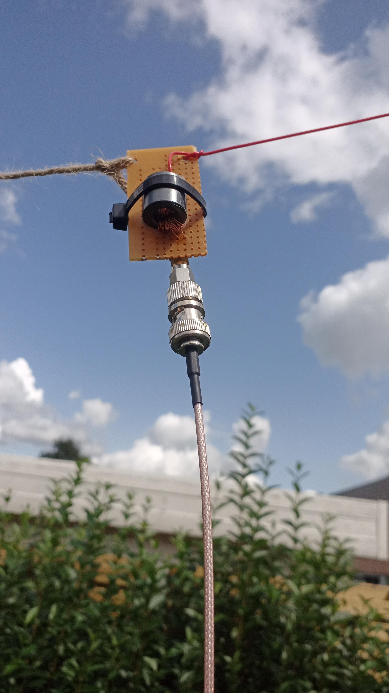
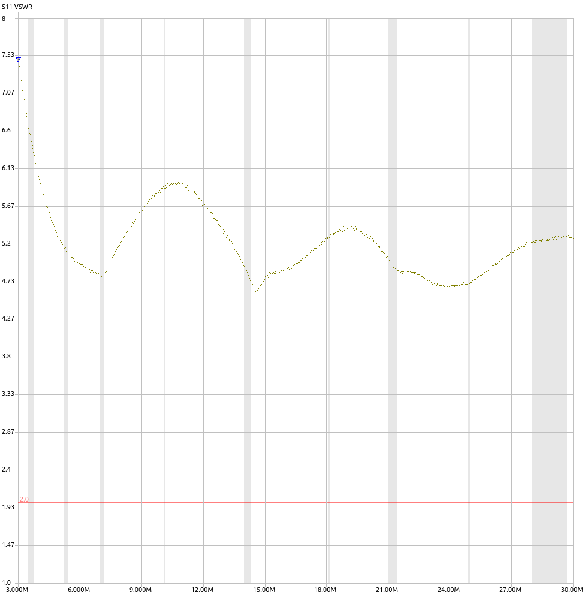
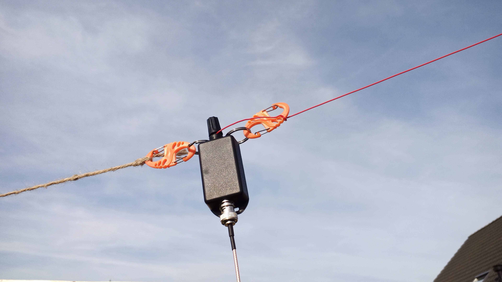
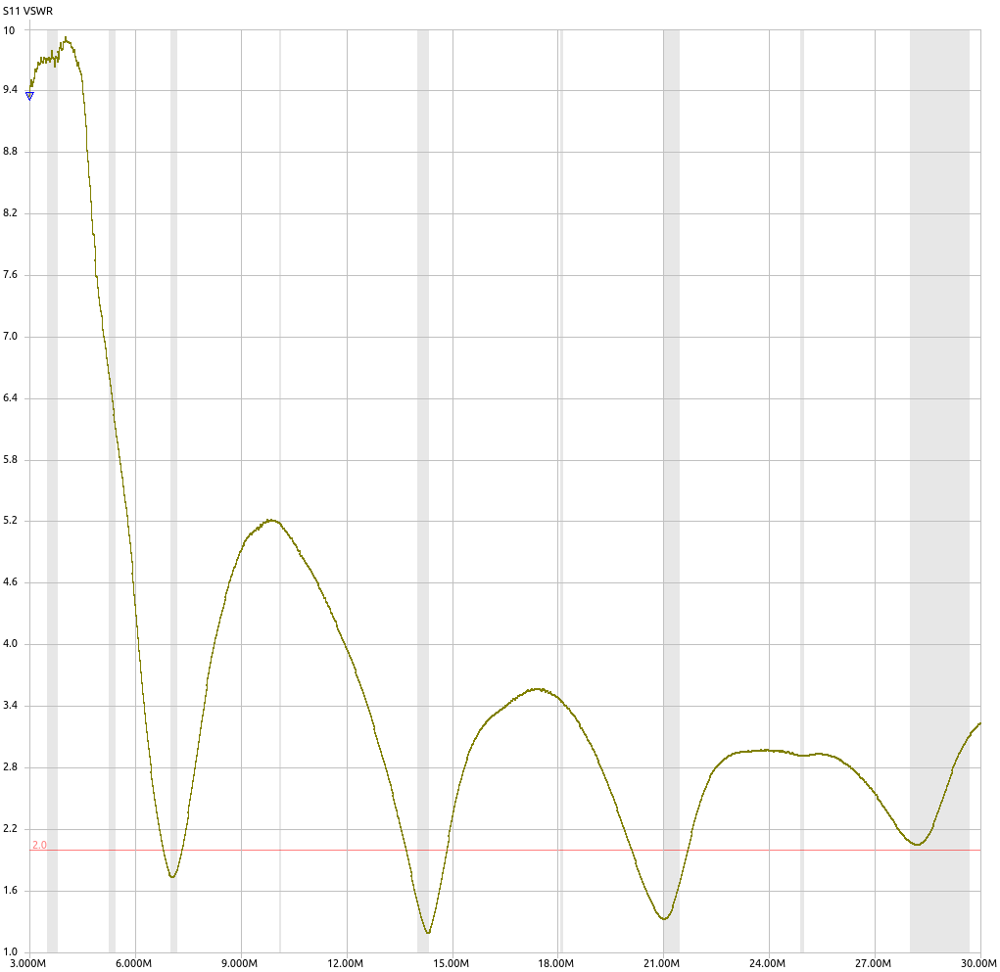
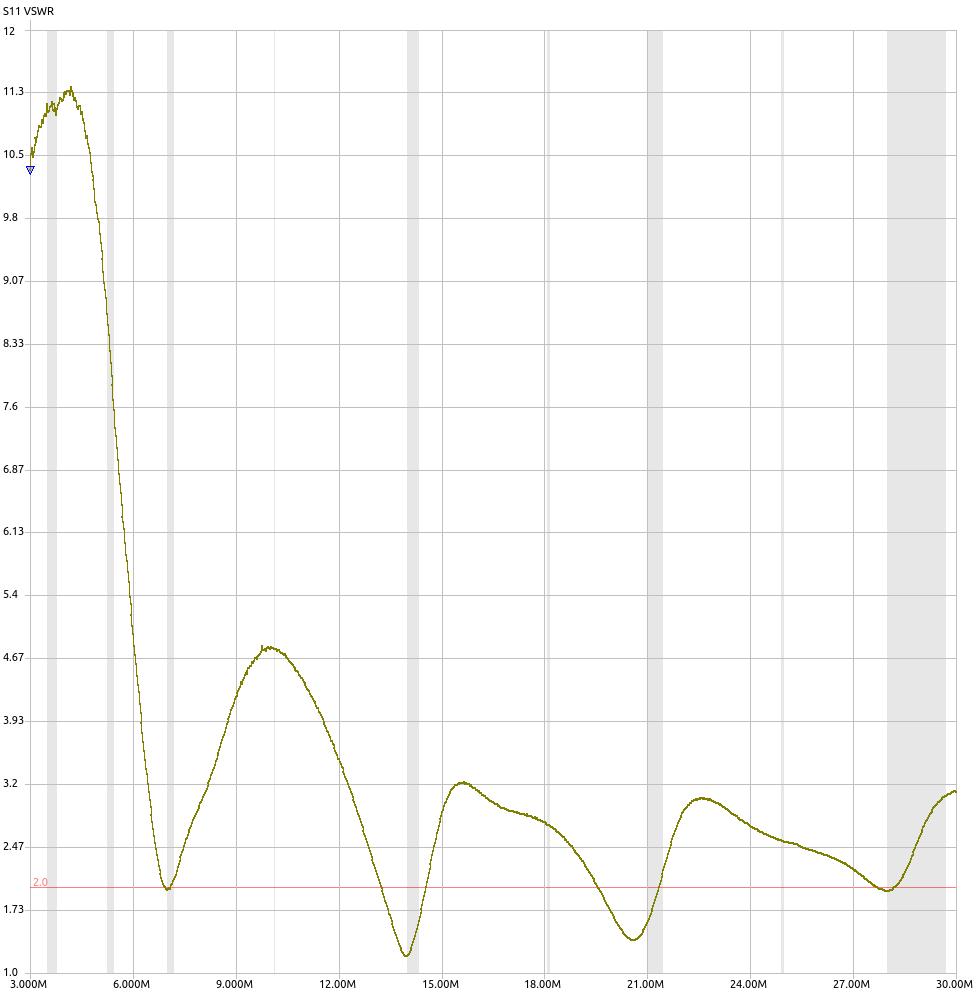

# Antenna for 40m, 20m, 15m, 10m

First version of the antenna.  Made on perfboard and using household wire.

## Antenna setup
An SDRplay RSP1A is connected to 10m coax on the ground, which is connected to the EFHW transformer, about 2m above ground.  The left side of the perfboard is connected with a few meters of isulated wire to a fence.  The right side of the perfboard connects to the antenna wire.  The antenna wire is connected to the secondary of the transformer.  The primary and secondary coils of the transformer have a common ground.

The antenna wire is about 20m long, and it loops through a wire which hangs from a window at about 6m above ground.  Then leading back to a fence where it's fixed with an 8S carabiner.

The antenna setup resembles more or less an inverted V.  The angle between the antenna wire and the ground is about 30 degrees.

## VSWR measurement of the perfboard setup

VSWR on 10m is not great.  This might be improved by adding a 100pF capacitor in parallel with the primary coil.  To be tested.

Another option is to add inductance on the antenna wire, near the transformer.  This has been tested by [Gary Rondeau](https://squashpractice.com/2021/07/20/engineering-the-efhw-491-transformer-and-antenna/).

# Building the transformer into a housing

## VSWR measurement of the transformer in a housing

### Measurement 1 : Stupid mistake

Why is the performance so bad compared to the perfboard setup?

We're using the same antenna, the same core with unchanged secondary winding.  Primary winding has been rewound.  The common terminal of both windings is now connected to the BNC-ground, while in the perfboard setup, there was a wire (red insulation) connecting the common terminal to the ground of the SMA-connector.

The tests with 2450ohm termination already showed a serious degradation from the perfboard setup.  So we should get this setup (with 2450ohm termination) working first before we can expect good results with the antenna.

Back to the drawing board.

### Measurement 2

While taking pictures of the transformer setup, I noticed that the I forgot to connect the wire to the transformer.  So the transformer was not connected to the antenna wire.  This explains the bad results of the previous measurement.
It's a stupid mistake, but it learns you that you must always check your setup before taking measurements.

The performance is comparable to the perfboard setup.  So we can continue with the next step.

### Measurement 3 : with 100pF capacitor

Because it wasn't so much work to do this extra measurement.  It didn't seem to make much difference, so the 100pF capacitor is not needed.

## Parts list
| Item | Description | Qty | Price |
| ---- | ----------- | --- | ----- |
| [Hammond 1551HFLBK](https://www.trustedparts.com/en/part/hammond/1551HFLBK) | Enclosures, Boxes, & Cases Miniature/FlangedLid 2.36x1.38x.79" Black| 1 | €2.71 |
| [Deltron 552-0100 BLK](https://www.trustedparts.com/en/part/deltron-enclosures/552-0100%20BLK) | Test Plugs & Test Jacks INSULATED BLACK  | 1 | €1.38 |
| [AliExpress](https://www.aliexpress.com/item/32991699241.html) | 8s shape carabiner keychain orange | 4| €3.57/10pcs|
| [AliExpress](https://www.aliexpress.com/item/1005002686878536.html) | BNC-M/BNC-M cable, RG316, 5m | 2 | €19.40/2pcs |
| [AliExpress](https://www.aliexpress.com/item/32998333031.html) | F-BNC/F-BNC adapter | 1 | €1.66/2pcs |
| [AliExpress](https://www.aliexpress.com/item/1005001867862900.html) | M-BNC/F-SMA adapter | 1 | €5.64/2pcs |
| [AliExpress](https://www.aliexpress.com/item/33061511845.html) | Red, 50 Meters, 24AWG, UL1571 PVC insulated wire | ±20m | €18.25/50m |
| | metal rings, 25mm diameter | 2 | | |

## Notes
* Hammond enclosure idea from [MM0OPX EFHW](https://youtu.be/nZ-G4hJCTSM?t=1123)
* 10m coax cable is integral part of the antenna
* Many transformer boxes use wing nuts to connect the antenna wire.  This is not a good idea, because the wing nuts can easily get lost.  That's why I opted for a binding post connector.

## Pitfalls during the building process
* The common point of primary and secondary windings should be connected to the ground of the coax cable, not the center conductor.
* Be sure to heat up the enameled wire high enough the burn off the enamel (>400°C).  Otherwise the solder won't stick to the wire.
* Check for continuity with a multimeter.  The primary winding should have a slightly lower resistance than the secondary winding.
* Check the SMA-connector where the load resistor is attached to.  The white isolating ring and the center pin might get dislodged.  Push them back in place with a small screwdriver.

# Antenna test
## Radio
* [SDRplay RSP1A](https://www.sdrplay.com/rsp1a/) : SDR receiver

## Web tools
* [PSK-reporter](https://www.pskreporter.info/pskmap.html) : shows active stations on a map for FT-8, FT-4, JT-65, JT-9, WSPR, and more over different bands
* [DX-view](https://hf.dxview.org/perspective/JO10qv) : world map of propagation over different bands

## Software setup
* [SDRuno](https://www.sdrplay.com/sdruno/) : for controlling the SDRplay RSP1A.  Not my favorite software, but it works.
* [VB-CABLE Virtual Audio Device](https://vb-audio.com/Cable/) : for routing audio from SDRuno to WSJT-X.  This is a virtual audio device, which is used as input in WSJT-X.  SDRuno is configured to output audio to this virtual device.
* [WSJT-X](https://wsjt.sourceforge.io/wsjtx.html) : for decoding FT-8 signals
* [GridTracker](https://gridtracker.org/) : shows decoded signals on a map

## Results
[PSK-reporter](https://www.pskreporter.info/pskmap.html) shows that FT-8 is by far the most popular mode on HF.  Moreover, the cycle time is only 15s (compared to 2mins for WSPR).  This means that you can quickly receive a lot of signals, and you can quickly see if your antenna is working.

### 40m-band

### 20m-band

### 15m-band

### 10m-band
