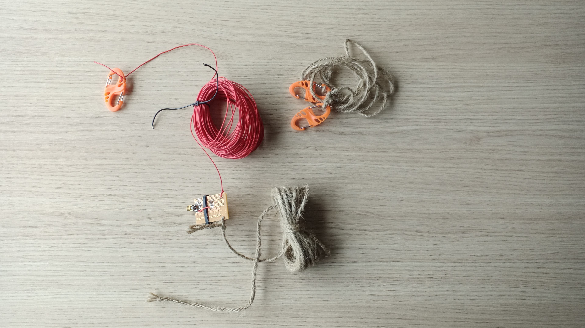
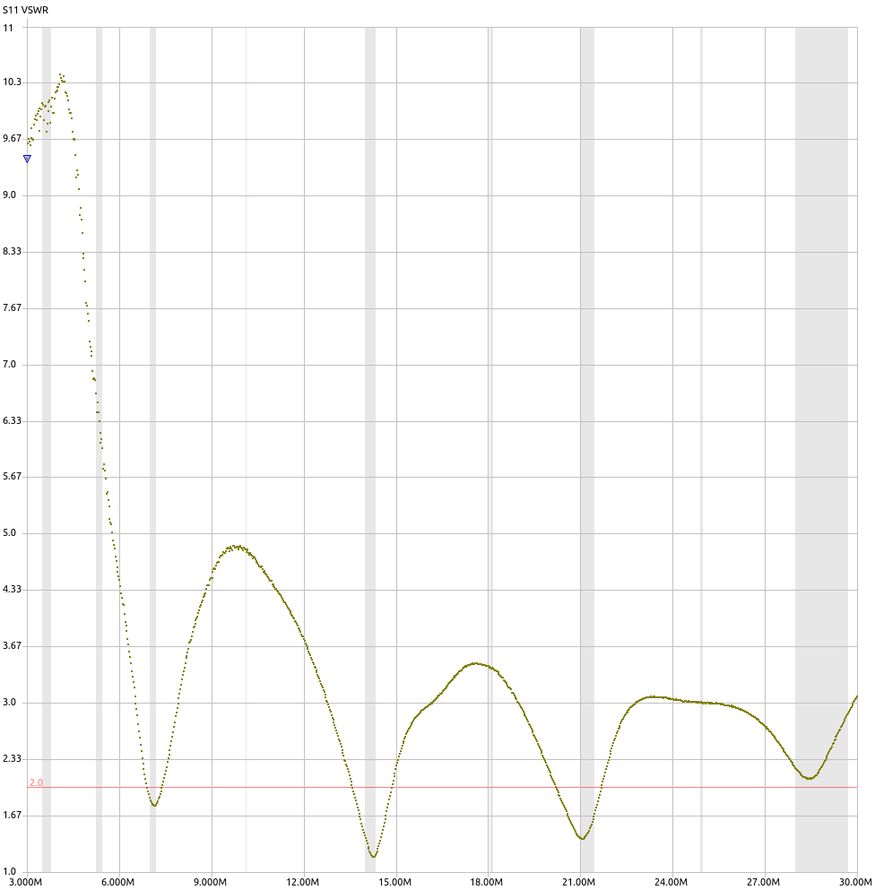

# Antenna for 40m, 20m, 15m, 10m

First version of the antenna.  Made on perfboard and using household wire.

## VSWR measurement

VSWR on 10m is not great.  This might be improved by adding a 100pF capacitor in parallel with the primary coil.  To be tested.

Another option is to add inductance on the antenna wire, near the transformer.  This has been tested by [Gary Rondeau](https://squashpractice.com/2021/07/20/engineering-the-efhw-491-transformer-and-antenna/).

# Parts list
| Item | Description | Qty | Price |
| ---- | ----------- | --- | ----- |
| [Hammond 1551HFLBK](https://www.trustedparts.com/en/part/hammond/1551HFLBK) | Enclosures, Boxes, & Cases Miniature/FlangedLid 2.36x1.38x.79" Black| 1 | €2.71 |
| [Deltron 552-0100 BLK](https://www.trustedparts.com/en/part/deltron-enclosures/552-0100%20BLK) | Test Plugs & Test Jacks INSULATED BLACK  | 1 | €1.38 |
| [AliExpress](https://www.aliexpress.com/item/32991699241.html) | 8s shape carabiner keychain orange | 4| €3.57/10pcs|
| [AliExpress](https://www.aliexpress.com/item/1005002686878536.html) | BNC-M/BNC-M cable, RG316, 5m | 2 | €19.40/2pcs |
| [AliExpress](https://www.aliexpress.com/item/32998333031.html) | F-BNC/F-BNC adapter | 1 | €1.66/2pcs |
| [AliExpress](https://www.aliexpress.com/item/1005001867862900.html) | M-BNC/F-SMA adapter | 1 | €5.64/2pcs |
| [AliExpress](https://www.aliexpress.com/item/33061511845.html) | Red, 50 Meters, 24AWG, UL1571 PVC insulated wire | ±20m | €18.25/50m |

# Notes
* Hammond enclosure idea from [MM0OPX EFHW](https://youtu.be/nZ-G4hJCTSM?t=1123)
* 10m coax cable is integral part of the antenna