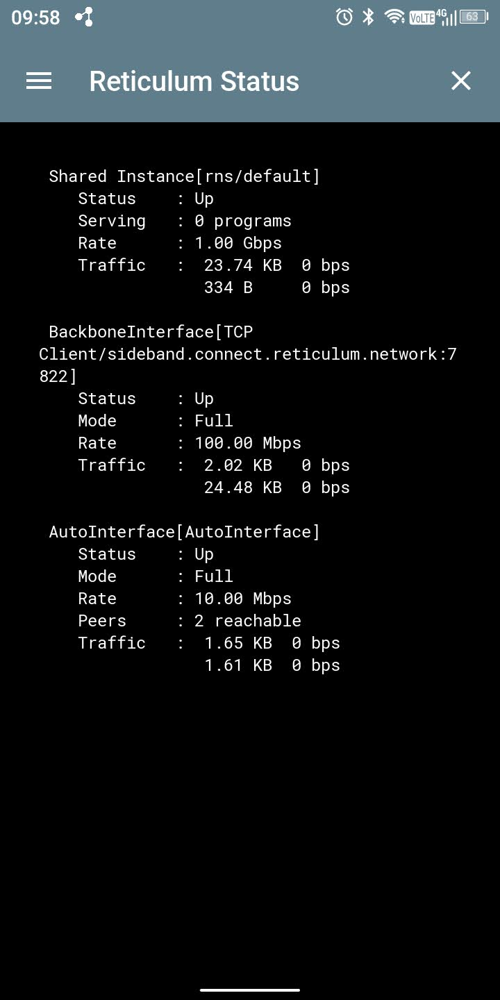

# Sideband
## Linux
### Firewall Configuration

If you're running a firewall like UFW, make sure to allow incoming v6 connections to Reticulum's default ports (29716 and 42671 on UDP and TCP):
```bash
sudo ufw status
Status: active

To                         Action      From
--                         ------      ----
29716 (v6)                 ALLOW       Anywhere (v6)             
42671 (v6)                 ALLOW       Anywhere (v6)
```
For more info, checkout [Reticulum manual : interfaces configuration](https://reticulum.network/manual/interfaces.html)


# Propagation Nodes
Check the network status by "Utilities -> Reticulum Status" menu option.

## Android
There's already a LXMF propagation node configured by default (see Preferences tab)
<figure>

<figcaption>Reticulum for Android settings screen showing default propagation (BackboneInterface) node.</figcaption>
</figure>

## Linux
No propagation node configured by default.
<figure>

<figcaption>Reticulum for Linux settings screen showing no propagation node (BackboneInterface) configured.</figcaption>
</figure>


# Caveats
## Android
### LXMF address
To get your local LXMF address, go to "Preferences".  Be careful that due to the limited screen size, only the right most part of the address is visible.  You may need to copy it to clipboard to see the full address.

### Message for propagation versus direct delivery
Reticulum for Android by default sends its data to a propagation node.  If your peer device is in the local network and doesn't have a public interface configured (i.e. default linux setup), it will not receive the message.  You have to make sure that "direct delivery" is selected instead.

<figure>

<figcaption>Reticulum for Android settings screen showing "direct delivery" configuration.</figcaption>
</figure>