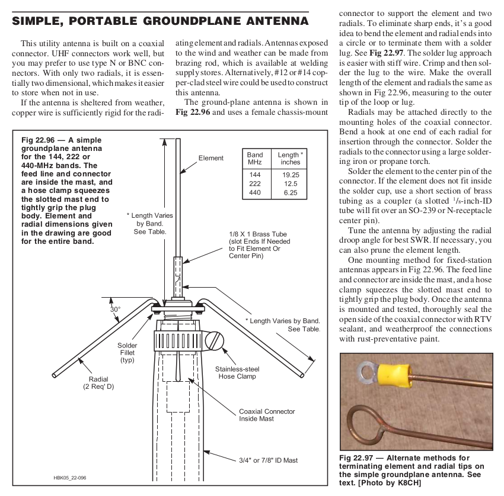

# Antenna theory
* [Understanding Antenna Specifications and Operation : Application Note AN-00501](https://www.linxtechnologies.com/wp/wp-content/uploads/an-00501.pdf)
* VSWR < 2.0 is acceptable.  Less than 10% of the power will be reflected back to the transmitter.
* Baluns avoid RF-radiation and noise pickup from the feed line:
  * These baluns should be placed as close as possible to a balanced type antenna (feed point). 
  * Might not needed for monopole antennas because they're unbalanced.
* FCC CFR Part 15 forbids standard connectors like SMA.  RP-SMA is allowed.
* The frequency of lowest VSWR is not necessarily equal to a resonant frequency of the antenna.
  * lowest VSWR = antenna impedance closest to 1 on Smith chart.
  * resonance = antenna impedance is purely resistive, on X-axis on Smith chart.

# Antenna types
## Dipole antenna
[The simple coax cable emergency prepper antenna](https://www.youtube.com/watch?v=tafy51yUzQo)

## λ/4 Monopole antenna
For the rubber ducky antenna from your HT, it's your body that serves as a counterpoise (ground plane).  Don't connect these rubber ducky antennas directly to a length of coax without a ground plane, because the antenna won't work properly then.  VSWR of 11:1 is not uncommon in that case.  See [λ/4 ground plane antenna](#quarter-wave-ground-plane-antenna) for details on the necessary radials.

* Zin = 36Ω at the resonance frequency (over an infinite ground plane)
* Maximum gain = 5.15dBi (3dB more than dipole antenna)
* Monopole antennas need a ground plane, so you shouldn't use them with a u.fl to SMA cable assembly.  Dipole antennas can be used with u.fl-SMA cables.
* Monopole antennas can be used with edge soldered SMA-connectors.

### Testing
* VSWR measurements on quarter wave monopole antennas don't mean much in reality.  So the measurements below should be taken with a grain of salt.  
* The λ/4 monopole antenna performance strongly depends on the size and orientation of the ground plane and hand capacity (add CM-choke to feed point!) etc...
* An antenna with a good VSWR in a lab setup (using a large perpendicular ground plane) doesn't guarantee it will perform well in real life conditions, when it's connected to your HT.

### References
* [Real world antenna testing](https://github.com/StuartsProjects/AntennaTesting)
* [Testing Ham Radio HT Antennas (Signal Stick, Nagoya, Diamond)](https://youtu.be/3Qve78EwXjc?t=3006)
* [#188 Antenna Tutorial incl. cheap DIY Antenna Tester (LoRa, ESP32)](https://www.youtube.com/watch?v=J3PBL9oLPX8)
* [Radio link budget calculator](https://en.jirous.com/calculation-wifi)
  * better to use a tool that calculates MPPL (multipath power loss, see theThingsNetwork) instead of free space losses
  * 434MHz TX, 0dBi antenna, 0dB cable loss: 20dBm → 100m→ RX: -45dBm
  * Doubling distance will lower received power with 6dB

### Examples
* [AliExpress WirelessLink store PM433-ZB165BM (71A, 433MHz 16.5cm ZT SMA)](https://www.aliexpress.com/item/32986676159.html)
* [Super-Elastic Signal Stick](https://signalstuff.com/product/super-elastic-signal-stick/), made of [nitinol](https://signalstuff.com/product/super-elastic-signal-stick-sma-male/).

## Flower pot antenna
* Cable ferrite WE 74270062 : cheap (€1), might put two in series, fits 5mm od cable
* Cable ferrite WE 74270043 : alternative to first one.
* [Half-wave flower pot](https://vk2zoi.com/articles/half-wave-flower-pot/)(HT2T antenna from CB-world)
* [Flower pot for 2m & 70cm](http://tigereye.net.au/vk4ion/docs/Antenna_Flower_Pot_2M_70cm_Dual_Band.pdf)
* [flower pot / sleeve dipole / T2LT antenna](https://www.m0mcx.co.uk/m0mcx-banana-antenna-an-end-fed-choke-sleeve-resonant-feedline-t2lt-antenna-design/)

## Sleeve dipole antenna, bazooka antenna
* [Sleeve Dipole Antenna Design and Build](https://incompliancemag.com/article/sleeve-dipole-antenna-design-and-build/)
* [Extended PMR Antenna UHF/PMR446](https://www.youtube.com/watch?v=WVFZ77vH2Jw) : uses a Coiled-Coax Choke Balun near the antenna, which is probably not very effective.
* [Make Your Own FM Vertical Sleeve Coax Antenna](https://www.youtube.com/watch?v=hK0KX0YcvH0): no balun at all
* [T2LT DX Vertical Bazooka - The Cheapest CB Antenna you can buy or make.](https://www.youtube.com/watch?v=lwbT4ZX6514)

## Slim jim antenna, roll-up J-pole antenna
The trouble with this antenna might be to get ladder line.  On AliExpress you can find 300ohm twin lead FM dipole antenna.  You can also simply buy an Ed Fong J-pole antenna.

* [Essexham](https://www.essexham.co.uk/slim-jim)

## Quarter wave ground plane antenna
The go-to antenna here is a ground plane antenne.  The resonant frequency can easily be tuned by cutting the monopole, while the impedance can be tuned by folding the radials.

<figure>
    
    <figcaption>Quarter-wave ground plane antenna from ARRL</figcaption>
</figure>

[Double Your HT Antenna Gain!](https://youtu.be/Y69mFGfXdJc):
* Uses elastic SignalStick antenna 
* 3 radials are enough
* Tuning the radials:
  * Make the radials 5% longer than the calculated length
  * Trim the radials one by one to get the lowest SWR
  * Don't cut the radials, but fold back and twist.  This gives you an eyelet to hang the antenna and it lowers the Q factor a bit, increasing the bandwidth.
* When touching the coax shield, the SWR changes, then your cable is radiating.  Connect a CM-choke at the feedpoint to prevent this.
[Ham Radio - A quarter wave groundplane antenna for your HT](https://www.youtube.com/watch?v=ViodMxV77eM)

## Discone antenna
Wideband, suitable for scanning
[Portable discone antenna](https://hackaday.io/project/169167-portable-discone-antenna)

## Yagi-Uda antenna
* [Tape measure Yagi Antenna](https://www.instructables.com/433-MHz-tape-measure-antenna-suits-UHF-transmitte/)

# Antenna Tuning
* Monopole antennas must be used with a ground plane
* Use smith chart to find resonant frequency.  That will be where the graph crosses the horizontal axis.
* Tune the length of the elements to get the resonant frequency at the desired frequency.
* If antenna tuning is not possible (because of a COTS-antenna), you can use a matching network to match your radio's impedance  to the antenna impedance in an effort to get the VSWR < 2.0.
* [Antenna Tuning for Beginners](https://www.baseapp.com/iot/antenna-tuning-for-beginners/)

# Coax 
## Feed line
The 2018 ARRL Handbook, table 22.60 lists very different results.  So better order a small sample first and test it before ordering larger quantities.

| Type          | loss [db/100m] @ 1GHz | Source                                                                                     |
|---------------|------------------------|--------------------------------------------------------------------------------------------|
| RG-400 / RF400| 13.2                   | similar to LMR400, [ead-ltd](https://www.ead-ltd.com/products/rf-cables/rf400-cables/rf400-very-low-loss-rf-coaxial-cable) |
| RF240         | 26                     | similar to LMR240, [wifi-shop24](https://www.wifi-shop24.com/coax-cable-configurator-rf240-antenna-cable) |
| RF195         | 37.5                   | similar to LMR195                                                                          |
| RG-142        | 42-50                  | [AliExpress](https://www.aliexpress.com/item/32876097914.html) (€8.03/m), -1.4dB @ 3GHz  |
| RG-58         | 70.5                   | [AliExpress](https://www.aliexpress.com/item/32900643953.html) (€5.18/m)                 |
| RG-316        | 94                     | [AliExpress](https://www.aliexpress.com/item/32948634584.html) (1m, 2xSMA, €2.75+€1.21) |
| RG-174        | 125                    |                                                                                            |
| RG-178        | 151                    |                                                                                            |
    
# Terminations
[Building your own calibration loads](https://youtu.be/NSAQ2iQNX2I?t=788) or buy them:
* [0 ohm SMA plug (Digikey €11.16)](https://www.digikey.be/product-detail/nl/amphenol-sv-microwave/SF8018-6007/SF8018-6007-ND/6201832)
* [50ohm SMA plug (Digikey €4.30)](https://www.digikey.be/product-detail/en/molex/0733910680/WM9473-ND/3878259)
* [Open SMA plug (Digikey €1.77)](https://www.digikey.be/product-detail/nl/amphenol-rf/202112/ACX1250-ND/1011927)

    
